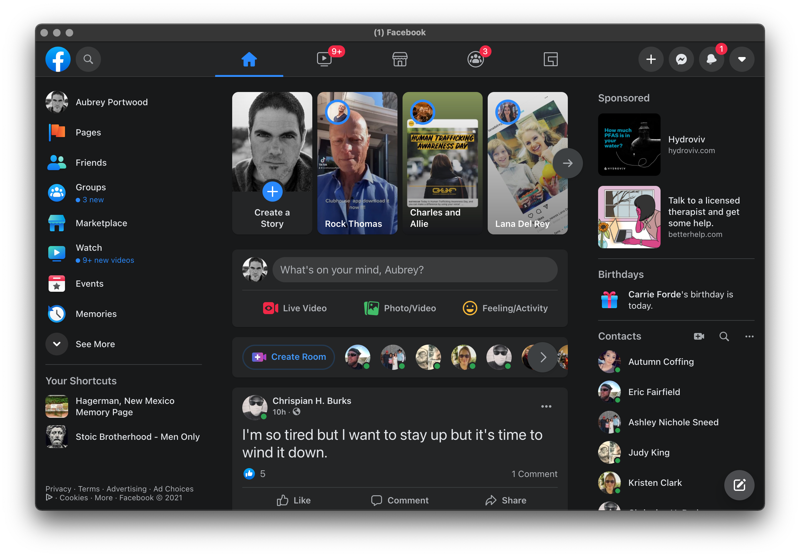

# Facebook

An (unofficial) native MacOS App for Facebook.

# Install

Download the `.dmg` in [releases](https://github.com/aubreypwd/facebook-mac/releases/latest) and install per usual or install with:

- [Homebrew...](https://github.com/aubreypwd/homebrew-cask#facebook)

*_Note, you will have to Right-click on the Facebook to open for the first time._*

---

# Development

1. Clone repo
2. `npm install`
3. `npm run build`

`npm run build` will built the application to `build/` and  `npm run dist` to generate a `.dmg` in `dist/` for distribution and installation.
